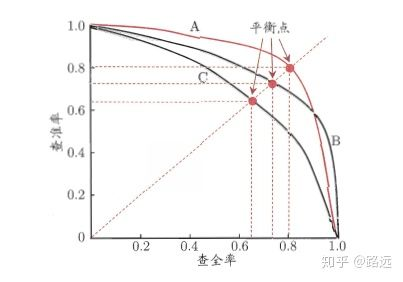
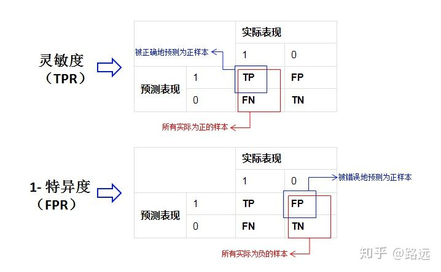
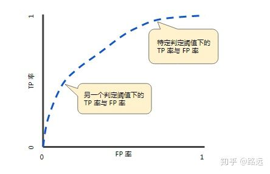
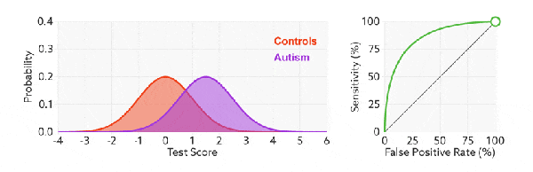
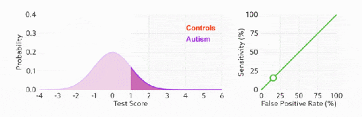
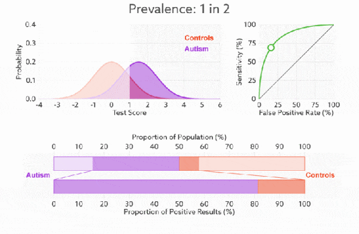

# 分类模型评估指标

#### 1.混淆矩阵

<table>
	<tr>
        <td colspan="2"  rowspan="2"></td>
        <td colspan="2">实际表现</td>
    </tr>
    <tr>
        <td>1</td>
        <td>0</td>
    </tr>
    <tr>
        <td rowspan="2">预测表现</td>
        <td>1</td>
        <td>TP</td>
        <td>FP</td>
    </tr>
    <tr>
        <td>0</td>
        <td>FN</td>
        <td>TN</td>
    </tr>
</table>

- **P（Positive）：** 代表1
- **N（Negative）：** 代表0
- **T（True）：** 代表预测正确
- **F（False）：** 代表预测错误

机器判断对不对（预测是否准确）：T/F

机器判断是不是（预测结果）：P/N

- **TP：** 预测为1，实际1，预测正确

- **FP：** 预测为1，实际0，预测错误

- **FN：** 预测为0，实际1，预测错确

- **TN：** 预测为0，实际0，预测正确

#### 2.准确率 - Accuracy

准确率的定义是预测正确的结果占总样本的百分比，代表整体的预测准确程度，既包括正样本和负样本。

Accuracy = (TP+TN)/(TP+TN+FP+FN)

如果样本不平衡，准确率就会失效，比如99个1和1个0。

#### 3.精确率（差准率）- Precision

针对预测结果，在所有被预测为正的样本中实际为正的样本的概率。在预测为正样本的结果中，我们有多少把握可以预测正确。

机器猜对的/机器猜的是正样本1的

Precision = TP/(TP+FP)

#### 4.召回率（查全率）- Recall

针对原样本，在实际为正的样本中被预测为正样本的概率。

机器猜对的/正样本1

Recall = TP/(TP+FN)

测坏用户时召回率越高，代表实际坏用户被预测出来的概率越高。

#### 5.F1分数

精准率和召回率的关系,找到二者之间的一个平衡点。

	

F1=(2×Precision×Recall)/（Precision+Recall）

#### 6.ROC/AUC

灵敏度（Sensitivity） = TP/(TP+FN)
特异度（Specificity） = TN/(FP+TN)
真正率（TPR） = 灵敏度（Sensitivity） = TP/(TP+FN)
假正率（FPR） = 1- 特异度 = FP/(FP+TN)

	

###### 6.1ROC曲线（接受者操作特征曲线Receiver Operating Characteristic）


**阈值：**ROC为真正率（FPR）和假正率的曲线图，通过遍历所有阈值即改变预测的正负样本数绘制。





**好坏：**FPR 表示模型虚报的响应程度，而 TPR 表示模型预测响应的覆盖程度。TPR越高，同时FPR越低，即ROC曲线越陡，模型性能越好。



**无视不平衡：**无论红蓝色样本比例如何改变，ROC 曲线都没有影响。



###### 6.2AUC（曲线下的面积Area Under Curve）

计算 ROC 曲线上的点的一种基于排序的高效算法，连接对角线，面积正好是0.5。对角线的实际含义是：随机判断响应与不响应，正负样本覆盖率应该都是50%，表示随机效果。 ROC曲线越陡越好，所以理想值就是1，一个正方形，而最差的随机判断都有0.5，所以一般AUC的值是介于0.5到1之间的。

**AUC的一般判断标准**

- **0.5 - 0.7：** 效果较低，但用于预测股票已经很不错了

- **0.7 - 0.85：** 效果一般

- **0.85 - 0.95：** 效果很好

- **0.95 - 1：** 效果非常好，但一般不太可能

曲线下面积的一种解读方式是看作模型将某个随机正类别样本排列在某个随机负类别样本之上的概率

###### 6.3ROC/AUC的Python实现

```
from sklearn import metrics
from sklearn.metrics import auc 
import numpy as np
y = np.array([1, 1, 2, 2])  
scores = np.array([0.1, 0.4, 0.35, 0.8])  
fpr, tpr, thresholds = metrics.roc_curve(y, scores, pos_label=2)
metrics.auc(fpr, tpr) 

0.75
```

